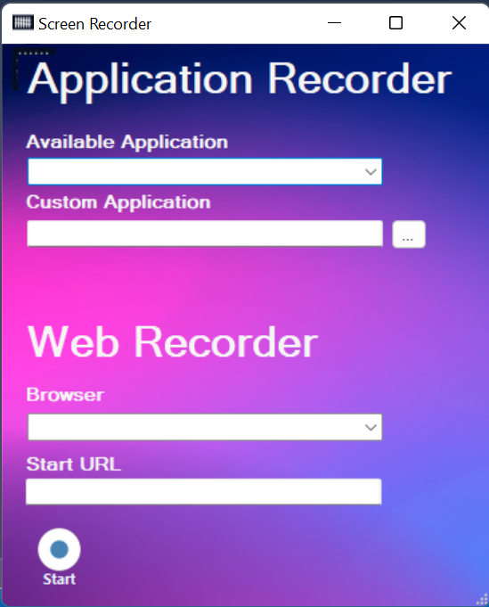

Record
======

Recording can help you save a lot of time when automating your business processes. This functionality enables you to easily capture a user’s actions on the screen and translates them into sequences.

These projects can be modified and parameterized so that you can easily replay and reuse them in as many other processes as you need.

Recording toolbar enables you to automatically record multiple actions performed on the screen
Manually record actions, such as:

- Clicking an interface element
- Selecting an option from a drop-down list
- Selecting a check box
- Simulating keystrokes or keyboard shortcuts
- Activating a window

**Example of recording with Application Recorder**

  - Step 1: In the **Tools** tab, select **Record**.
  - Step 2: Select application in **Available Application** or Choose application in **Custom Application**.
  - Step 3: Open application.
  - Step 4: In the **Screen Recorder**, click Start. The automatic recording process starts.
  - Step 5: In the application, Press **Ctrl** and click selector, A pop-up window is displayed.
  - Step 6: Press **Stop**. You exit the recording view and the saved project is displayed in the new sequence.

